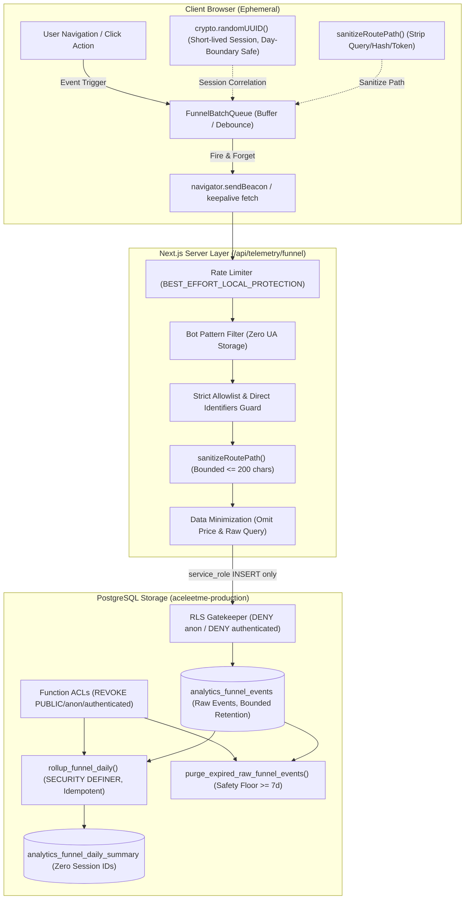

# ACELEETME.TECH — ANALYTICS V1 DURABLE STORAGE PREFLIGHT
## Master Program Wave 2.3A — Final Security & Operations Closure

**Document Version:** 1.1.0  
**Generated At:** 2026-10-04T21:08:00Z  
**Governance Mode:** `CONTROLLED_DB_DESIGN + TRANSACTIONAL_REHEARSAL + SECURITY_CLOSURE`  
**Execution Status:** `WAVE_2_3A_ANALYTICS_SECURITY_CLOSURE_PASS — ZERO PERSISTENT WRITES`  

---

### 1. Executive Summary & Baseline

Analytics V1 establishes durable event storage architecture for AceleEtme's conversion funnel while enforcing strict technical data minimization, fail-closed access control, privilege revocation, and privacy protections.

- **Baseline Wave:** `WAVE_2_2B = PASS`
- **Catalog State:** `CANONICAL_PRODUCTS = 5814`, `EMPTY_SPECS = 375`
- **Application State:** `ANALYTICS_APPLICATION_READY = YES`
- **Production Persistence Mode:** `EVENT_DISPATCH_ONLY / MOCK_SINK` (`SUPABASE_ANALYTICS_ENABLED = false`)
- **Rate Protection:** `BEST_EFFORT_LOCAL_PROTECTION`
- **Privacy Classification:** `NO_DIRECT_IDENTIFIERS_PERSISTED` / `EPHEMERAL_RANDOM_SESSION_ID_ONLY`
- **Target Funnel Stages:**
  ```text
  HOME (landing_view)
    → SEARCH (search_performed)
      → PRODUCT (product_view)
        → COMPARE (comparison_started)
          → RETAILER_OUTBOUND_CLICK (retailer_outbound_click)
  ```

---

### 2. Operational Invariants & Governance Contracts

1. **Zero Public Client DB Access:**
   Browsers and public clients are strictly prohibited from connecting or writing directly to Supabase analytics tables. All events must traverse `POST /api/telemetry/funnel` for server-side payload validation, key allowlisting, and sanitization.
2. **Server-Only Ingestion Role:**
   Only the trusted server-side execution context using the elevated `service_role` can insert sanitized records into the durable database.
3. **Function Privilege Revocation & PostgREST RPC Protection:**
   In PostgreSQL, functions created in `public` grant `EXECUTE` to `PUBLIC` by default, exposing them via PostgREST RPC to anonymous visitors. The migration explicitly executes:
   ```sql
   REVOKE ALL ON FUNCTION public.rollup_funnel_daily(DATE) FROM PUBLIC, anon, authenticated;
   REVOKE ALL ON FUNCTION public.purge_expired_raw_funnel_events(INTEGER) FROM PUBLIC, anon, authenticated;
   GRANT EXECUTE ON FUNCTION public.rollup_funnel_daily(DATE) TO service_role;
   GRANT EXECUTE ON FUNCTION public.purge_expired_raw_funnel_events(INTEGER) TO service_role;
   ```
   Ensuring:
   - `PUBLIC_RPC_ROLLUP = DENIED`
   - `PUBLIC_RPC_PURGE = DENIED`
4. **Rollup Idempotency:**
   Executing `public.rollup_funnel_daily` multiple times for the same day deterministically upserts rows via `ON CONFLICT (summary_date, category, store_id) DO UPDATE SET...`. It never multiplies totals or produces duplicate rows (`DUPLICATE_SUMMARY_ROWS = 0`).
5. **Purge Safety Floor & Table Isolation:**
   `public.purge_expired_raw_funnel_events` validates `p_retention_days IS NULL OR p_retention_days < 7` and throws `PURGE_SAFETY_ERROR`. The deletion is strictly isolated to `public.analytics_funnel_events`; commercial catalog and pricing tables (`prices`, `price_history`, etc.) remain completely untouched.
6. **Path Sanitization & Token Stripping:**
   Route pathnames are sanitized by `sanitizeRoutePath()` on both client and route ingress:
   - Query strings (`?q=...`) stripped.
   - Hash fragments (`#...`) stripped.
   - Embedded credentials/tokens (`user:pass@`) stripped.
   - Bounded length enforced: maximum 200 characters (`MAX_PATH_LENGTH = 200`).
7. **Scheduler Contract:**
   No scheduler is created today. Candidates identified:
   - `ROLLUP_SCHEDULER_CANDIDATE = VERCEL_CRON_OR_PG_CRON (via protected /api/cron/rollup-funnel or pg_cron extension)`
   - `PURGE_SCHEDULER_CANDIDATE = VERCEL_CRON_OR_PG_CRON (via protected /api/cron/purge-analytics or pg_cron extension)`
   - Status: `SCHEDULER_REQUIRED`. Retention must not be described as active in production until a scheduled runner is provisioned: `RETENTION_CURRENTLY_ENFORCED = NO (scheduler pending)`.
8. **Operational Session Scope:**
   Session identifiers are ephemeral, cryptographically random client-side UUIDs (`crypto.randomUUID()`). They exist solely for operational session correlation across a single browsing session and automatically rotate at UTC midnight. They are never derived from IP addresses, User-Agent strings, or device fingerprints.
9. **Technical Privacy Phrasing:**
   Terminology is strictly technical: `NO_DIRECT_IDENTIFIERS_PERSISTED`, `EPHEMERAL_RANDOM_SESSION_ID_ONLY`, and `DATA_MINIMIZED_FUNNEL_TELEMETRY`. AceleEtme makes no automated claims of being "KVKK exempt" or "GDPR exempt by technical design alone".
10. **Non-Blocking Telemetry Failure Tolerance:**
    Funnel telemetry is strictly secondary and non-critical. If the telemetry route fails (network partition, rate throttling, 5xx server error), page navigation and outbound retailer clicks continue seamlessly.

---

### 3. Funnel Architecture Diagram



---

### 4. Technical Data Minimization Ledger

| Column / Data Item | Proposed Status | Disposition | Governance Rationale |
|---|---|---|---|
| `id` | REQUIRED | **KEPT** | UUID primary key for deduplication and row identification. |
| `session_id` | REQUIRED | **KEPT** | Client-generated operational UUID; correlation within single session only. Rotates daily. |
| `event_type` | REQUIRED | **KEPT** | Strict enum constraint representing the 5 conversion funnel stages. |
| `path` | REQUIRED | **KEPT (SANITY-BOUNDED)** | Coarse route pathname (e.g. `/`, `/search`, `/phones`, `/compare`). Stripped of query params, hash, tokens; max 200 chars. |
| `category` | REQUIRED | **KEPT** | Coarse category slug (e.g. `smartphones`, `tvs`). |
| `product_id` | REQUIRED | **KEPT** | Canonical product root ID for outbound click attribution. |
| `store_id` | REQUIRED | **KEPT** | Merchant / retailer identifier for outbound conversion tracking. |
| `query_length` | REQUIRED | **KEPT** | Character length of search query. Substitutes raw search query. |
| `result_count` | REQUIRED | **KEPT** | Number of search results returned. Measures search friction. |
| `has_verified_price`| REQUIRED | **KEPT** | Boolean flag indicating catalog price presence. |
| `created_at` | REQUIRED | **KEPT** | Server timestamp for ordering and retention purge calculations. |
| `price` (numeric) | REMOVE | **OMITTED** | Funnel conversion analysis does not require financial observation amounts. |
| `raw query` | REMOVE | **FORBIDDEN** | Potential leakage of search terms, names, or typed identifiers. |
| `referrer` (HTTP) | REMOVE | **OMITTED** | Full referrers frequently contain tracking parameters, tokens, or personal paths. |
| `ip` | REMOVE | **FORBIDDEN** | Network address is never stored or persisted. |
| `user_agent` | REMOVE | **FORBIDDEN** | Raw User-Agent strings are never persisted. |
| `fingerprint` | REMOVE | **FORBIDDEN** | Hardware/canvas/audio device fingerprinting is strictly barred. |
| `email / account` | REMOVE | **FORBIDDEN** | Personal user credentials/identities are strictly barred. |

---

### 5. Access Control & Row Level Security (RLS) Matrix

| Target Object | Role | Privileges | Enforcement Mechanism |
|---|---|---|---|
| `analytics_funnel_events` | `anon` | **DENIED** | RLS `USING (false) WITH CHECK (false)` |
| `analytics_funnel_events` | `authenticated` | **DENIED** | RLS `USING (false) WITH CHECK (false)` |
| `analytics_funnel_events` | `service_role` | **ALLOWED** | RLS `USING (true) WITH CHECK (true)` |
| `analytics_funnel_daily_summary` | `anon` | **DENIED** | RLS `USING (false) WITH CHECK (false)` |
| `analytics_funnel_daily_summary` | `authenticated` | **DENIED** | RLS `USING (false) WITH CHECK (false)` |
| `analytics_funnel_daily_summary` | `service_role` | **ALLOWED** | RLS `USING (true) WITH CHECK (true)` |
| `public.rollup_funnel_daily` | `PUBLIC`, `anon`, `authenticated` | **DENIED** | `REVOKE ALL ON FUNCTION ... FROM PUBLIC, anon, authenticated;` |
| `public.rollup_funnel_daily` | `service_role` | **ALLOWED** | `GRANT EXECUTE ON FUNCTION ... TO service_role;` |
| `public.purge_expired_raw_funnel_events` | `PUBLIC`, `anon`, `authenticated` | **DENIED** | `REVOKE ALL ON FUNCTION ... FROM PUBLIC, anon, authenticated;` |
| `public.purge_expired_raw_funnel_events` | `service_role` | **ALLOWED** | `GRANT EXECUTE ON FUNCTION ... TO service_role;` |

---

### 6. Verification & Test Reconciliations

Execution of [scripts/test-analytics-v1-storage-preflight.ts](file:///C:/Projects/aceleetme-agent-workspaces/task_followup_fixes/scripts/test-analytics-v1-storage-preflight.ts):

- **TEST_CASES:** 18
- **ASSERTIONS:** 85
- **PASSED:** 18
- **FAILED:** 0
- **Regression Invariants:**
  - `CANONICAL_PRODUCTS = 5814`
  - `EMPTY_SPECS = 375`
  - `GOLDEN_REGRESSIONS = 0`
  - `PRICE_MUTATIONS = 0`
  - `SUPABASE_WRITES = 0`
